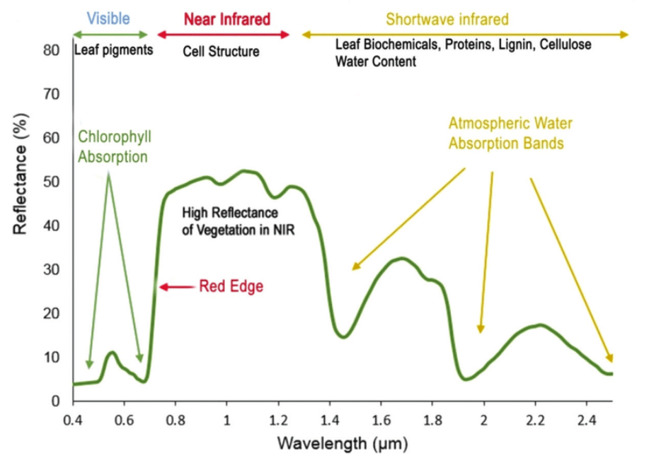

## general notes
- No class next week 2/11
- Assignment 1 due Friday 2/20 at midnight

## what have we covered
- Raster data, vector data, GeoTIFF, GeoJSON
- Coordinate reference systems 
    - Not working in the 3D world all the time
    - Instead often working in 2D cartesian coordinate systems, projected in some way which loses accuracy in either distorting areas, angles, or distances
- sensors
    - sentinel 2
    - landsat

## resolution tradeoff triangle
```     
       /\ 
    temporal
     /    \
    /      \  
   /        \
  /          \
 /            \
spatial___spectral
```

**Why can't we have all three?**
1. Energy constraint
2. Bandwidth

- Swath width = field of view as satellite is going across an orbit
- Sentinel 2 and Landsat sit right in the middle of the triange, are balanced in all three directions
- Geostationary maximizes temporal resolution as it's always imaging the same place
- For 50cm resolution
    - Have a lot of spectral bands
    - Imaging every day, if not more
    - If data is stored in `uint_16` format, it's a ton of data
    - Will easily overwhelm receiver if not careful
- Landsat, sentinel2, both do "agile pointing" 
    - Satellites are usually facing directly in line to imaging surface
    - Agile pointing is when you turn the satellite in space to look over the surface a customer wants that is close, but is not directly over the satelite
    - "nadir" = ideal angle over Earth (pointing directly to the center) given orbital pattern
    - In this case though, all sensor geometry has changed so you're looking to the side
    - An "off-nadir" image is often better than a perfectly nadir image as you have to don't want to wait for it to be directly over a certain spot

## frequency bands & performance metrics
- Visible light
- NIR infrared
    - NIR is great for vegetation studies
    - NDVI = normalized difference vegetation index
- Shortwave infrared
    - Great for water studies
    - NDWI = normalized difference water index

- Reflectance can be thought of as "brightness" in certain part of the frequency spectrum
    - On a scale from 0 (max dark) to 1 (max bright)


- Vegetation absorbs red light and reflects NIR
- Chlorphyll molecules are specifically tuned to absorb blue and red light
    - Because of this selected absorption, plants are green
    - Refkects NIR which is seen on the curve
- This transition creates the "red-edge" sharp increase between 680-730nm
    - Slope of red edge is a powerful indicator of plant health

- How to quantify the red edge?
    - Can do value at 730 - value at 680 
    - Want to do a normalized difference so it's always bounded
    - ND[R1, R2] (R1 = reflectance at r1, R2 = reflectance at R2) = (R1-R2) / (R1+R2)
    - R1-R2 = Contrast
    - R1+R2 = Normalizing factor, brightness
    - Always results in values from [-1, 1]
- NDVI = (NIR - Red) / (NIR + Red)
    - Vegetation index! bounded from [-1, 1]
    - Not saying values are always going to be the same, just a standard way of measuring and evaulting vegetation
    - Inherent signal here is apparently really strong that it's a useful metric beyond vegetation

- Can similarly come up with metric for water by studying its reflectance curve
    - NDWI1 = (Green - NIR) / (Green + NIR) ==> Good for surface water mapping
    - NDWI2 = (NIR - SWIR) / (NIR + SWIR) ==> Good for mapping water content in vegetation
    - There's various types of water bodies that have different reflectance characteristics

- NBR = (NIR - SWIR2) / (NIR + SWIR2)
    - Normalized burn ratio
    - There's two short wave infrared bands on sentinel2 and landsat
    - Normally used for mapping vegetation after wildfires
    - Healthy vegetaion consumed by fire -> decrease NIR -> increase SWIR2 (ash, soil)

## Composite Imagery
- Combining multiple images into one single image
- Taking areas from multiple images to piece together valid data 


## Atmospheric correction model
- Satellite sees the ground + the atmosphere
- To go from level 1 (TOA) => level 2 (SR) you have to apply atmospheric correction model
- Level 1 is what the sensor actually sees
- Level 2 is with the atmosphere removed
- We don't have to do this; there's a ton of fancy technology/sensors involved to do this
- Time series analysis becomes very hard to do with just "top of atmosphere" data (no atmospheric correction)
    - Want surface reflectance data for time series data

## Assignment
- Need to present results in a way that's a little bit removed from the technical questions
- He created the dataset for us and starting code
- Way to do this is to not strive for perfection, but instead get something that works and then optimize
- Part 1 is fixing stack of data
- Part 2 is develop a method to figure out pixels across stack (also cloud masking?)

